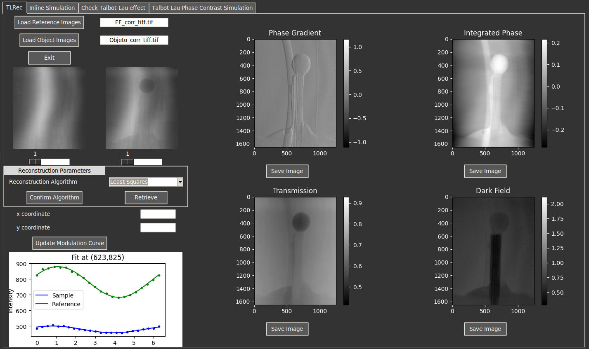

# XPCIpy
XPCIpy (X-Ray Phase Contrast Imaging in Python) is an open-source software developed in Python, designed for both the simulation of X-ray PCI, including Propagation-Based Imaging (PBI) and Talbot-Lau Phase-Contrast Imaging (TLPCI), and the reconstruction of TLPCI images. TALIXpy implements the phase stepping method for image retrieval, offering both least-squares and Fast Fourier Transform (FFT)-based reconstruction algorithms. It notably includes an algorithm for correcting phase step and dose fluctuations, which helps mitigate reconstruction artifacts like Moiré patterns.

## Table Of Contents
* [How to run](#How-to-run)
* [PCSim](#PCSim)
* [MoireSim](#MoireSim)
* [TLRec](#TLRec)
* [Notebooks](#Notebooks)
* [Dependencies](#Dependencies)
* [How to Cite](#How-to-Cite)
* [References](#References)
* [Contact](#Contact)

## How to run

1. **Clone the repository**  
```bash
git clone https://github.com/PREDICO-Project/XPCIpy.git
cd TALIXpy
```

2. **Create a virtual environment and install requirements**

```
python -m venv venv
source venv/bin/activate 
pip install -r requirements.txt
```

3. **Use example Notebooks**
Check [Notebooks Folder](Notebooks) for examples of simulations and Reconstructions.

4. **Download example reference and object images**
Example datasets for the TLRec module (Talbot-Lau Reconstruction) are available on [Zenodo](https://doi.org/10.5281/zenodo.16944391).
To use them with the [TLRec notebook](Notebooks/TLRec.ipynb), place the downloaded images in the [**Data/** ](Data/)folder.

5. **Use the GUI**
Alternatively, you can run the GUI developed using Tkinter.

```
python3 gui.py
```

<p align="center">
 </img>
</p>

## Notebooks
There is a Jupyter Notebook into the [Notebooks Folder](Notebooks) with an example of how to use the function to obtain the DPC images.

## PCSim
This module performs simulation of Propagation-based Imaging (PBI) and Talbot-Lau based Phase Contrast Imaging (TLPCI). For more information refere to the Jupyter notebooks for [PBI](Notebooks/Propagation.ipynb) and [TLPCI](Notebooks/Phase_Stepping.ipynb) and to its own [README](src/PCSim/Readme.md). 

## MoireSim
This module specializes in simulating Moir\'{e} artifacts in TLPCI, computing the Intensity Modulation Curve with artifacts due to step and dose fluctuations. For more information refer to its [Notebook](Notebooks/MoireSim.ipynb) and [README](src/Simple_Numerical_Simulation/Readme.md) file. 

## TLRec
This module specifically handles the phase-stepping analysis of Talbot-Lau interferometer images for phase-contrast image retrieval. For more information refer to its [Notebook](Notebooks/TLRec.ipynb) and [README](src/TLRec/README.md) file. 
## Dependencies
We have use some functions from some well known python libraries, the libraries used are:
* numpy
* scipy
* matplotlib
* Pillow
* skimage from scikit
* numba (we use numba to accelerate some calculations)
* tifffile
* opencv
* imageio

In the future we will reduce the dependencies to make it easier to run. 
To install all the libraries type in your terminal.

```
pip install -r requirements.txt
```

## How to Cite
If you **XPCIpy** in your research, please cite it:
```
@article{Sanchez-Lara:25,
author = {Victor Sanchez-Lara and Diego Garcia-Pinto},
journal = {Opt. Express},
keywords = {Biomedical imaging; Diffraction gratings; Fourier transforms; Phase contrast; Phase shift; X-ray imaging},
number = {22},
pages = {45949--45966},
publisher = {Optica Publishing Group},
title = {XPCIpy: A Python toolkit for X-ray phase-contrast imaging},
volume = {33},
month = {Nov},
year = {2025},
url = {https://opg.optica.org/oe/abstract.cfm?URI=oe-33-22-45949},
doi = {10.1364/OE.573918},
}
```

## References

Reference [2]: Massimi, L., Buchanan, I., Astolfo, A., Endrizzi, M., & Olivo, A. (2020). Fast, non-iterative algorithm for quantitative integration of X-ray differential phase-contrast images. Optics express, 28(26), 39677–39687. https://doi.org/10.1364/OE.405755.


## Contact
If there is any doubt please contact at the following e-mail: vicsan05@ucm.es


