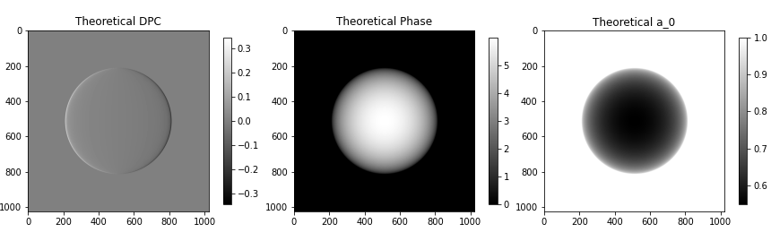
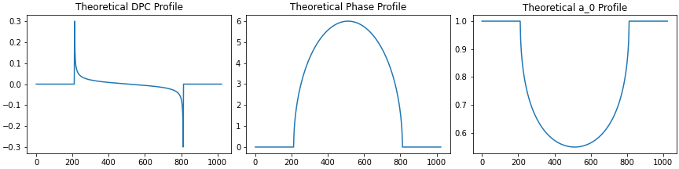
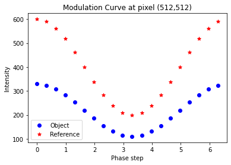
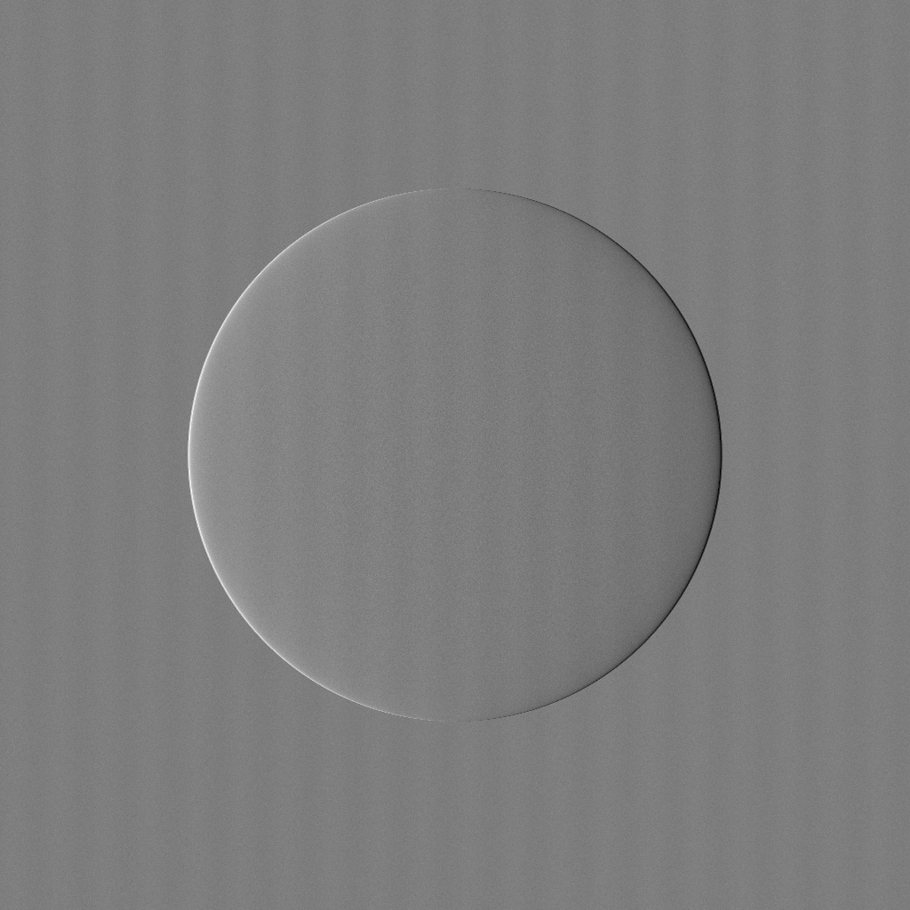
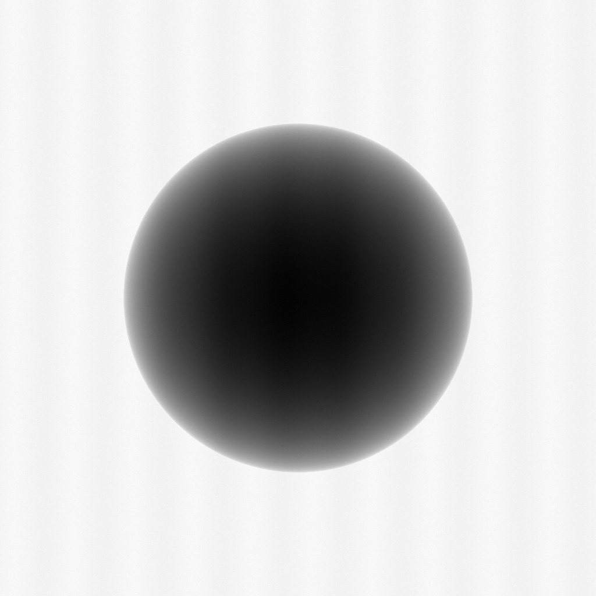
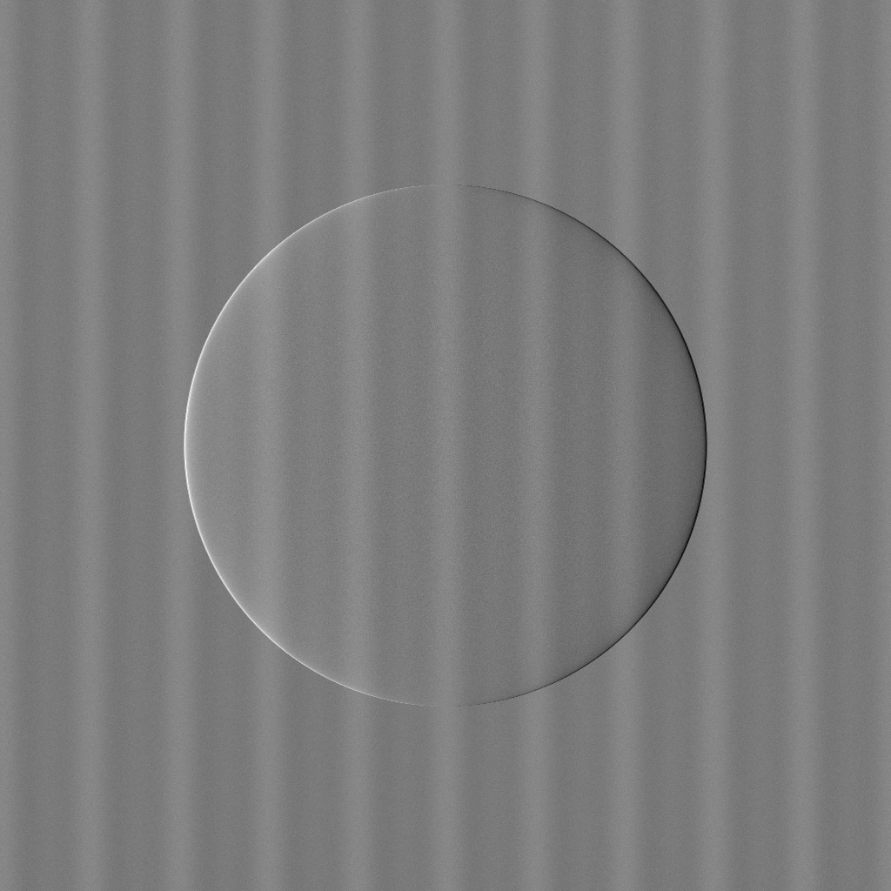
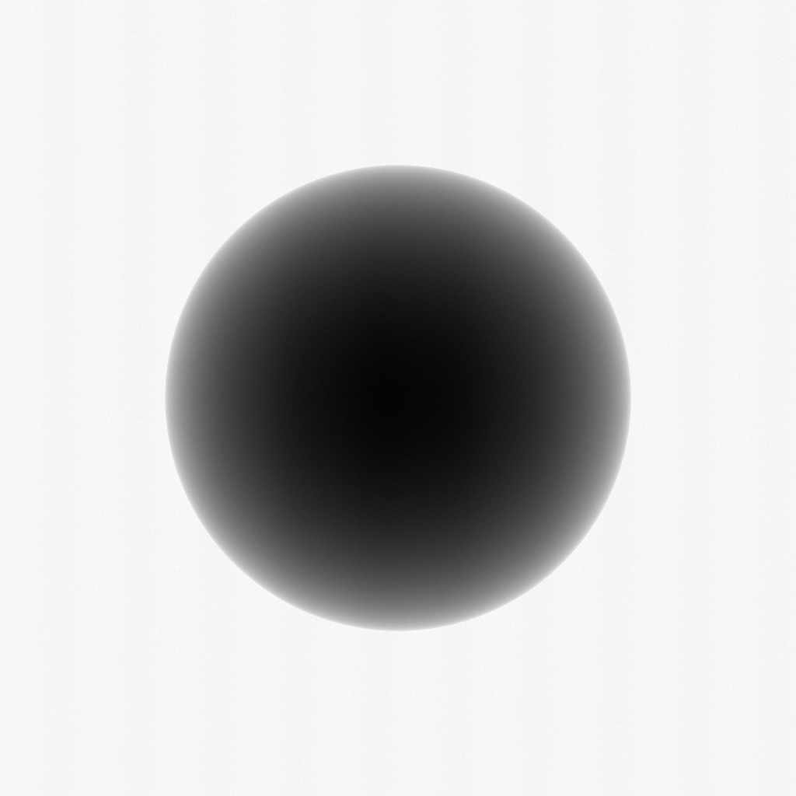

## Introduction
This folder contains the functions and classes to perform a simple numerical simulation of the modulation curve for each pixel using the next equation:

$$I_k (x,y) = exp(\lambda_k)*[a_0(x,y)+a_1(x,y)*cos(\frac{2\pi k}{M}+\Phi(x,y) + s_k)]+\eta_k(x,y)$$

Here, $I_k(x, y)$ represents the intensity of the pixel at coordinates $(x, y)$ during the k-th phase step. The common parameters of the modulation curve which depends on the object are $a_0\left(x,y\right)$, $a_1\left(x,y\right)$ and $\Phi\left(x,y\right)$. These parameters correspond to the offset, the amplitude and the phase of the sine-shaped curve by the object introduced. For simplicity, $a_1(x, y)$ is half of $a_0(x, y)$, which may lead to improper simulation of Dark Field Images.
Additionally, $\lambda_k$, $s_k$, and $\eta_k(x,y)$ correspond to the distributions of dose fluctuations, phase step errors, and noise introduced to the curve.

Additionally, you can simulate the Moire fringes as vertical fringes with a choosen period or frequency.

## Simulatable Objects

At present, it is only possible to simulate basic geometric objects such as spheres and cylinders. In the following figure, you can observe the profiles of $a_0(x, y)$ and $\Phi(x, y)$ for a sphere. 

 </img>

 </img>

## Modulation Curves

Once you have defined the object it is posible to run the simulation using the **Simulation** function inside [simulation.py](simulation.py) file. The modulation curve for a random pixel looks like:

 </img>

## Retrieve the DPC and Attenuation Images

You can utilize the code provided in this repository to carry out the retrieval of DPC and Attenuation Images. By doing so, you can assess how various algorithms perform in the retrieval of both phase and attenuation, even when different errors are introduced during the simulation.

### Results with phase step errors

When there are errors in the phase steps positions, when the reconstruction is done, some artifacts appears. These artifacts in theory are vertical fringes (it means, if the colocation of the gratings is perfect). You can see an example of a recontruction with these artifacts. It is necessary to introduce the Moire fringes artifacts. 

 </img>
 </img>

### Results with Dose fluctuations

When there are errors due to Dose fluctuations, when the reconstruction is done, some artifacts appears. These artifacts in theory are vertical fringes (it means, if the colocation of the gratings is perfect). You can see an example of a recontruction with these artifacts. It is necessary to introduce the Moire fringes artifacts.

 </img>
 </img>

