# TLRec
TLRec (Talbot-Lau Reconstruction) is an open-source code to retrieve the phase contrast image from a stack of images obtained by Talbot-Lau interferometer (Grating Based Interferometry). The code is based on python libraries.

## Table Of Contents
* [Introduction](#Introduction)
* [How to prepare the images](#How-to-prepare-the-images)
* [Experimental Retrieval](#Experimental-Retrieval)
  * [FFT based Algorithms](#FFT-based-Algorithms)
  * [Least Squares method based Algorithms](#Least-Squares-method-based-Algorithms)
* [DPC Images](#DPC-Images)
* [Phase Image](#Phase-Image)
* [How to run](#How-to-run)
* [Example](#Example)
* [Contact](#Contact)


## Introduction

X-ray Phase Contrast Imaging (PCI) has gained widespread popularity owing to its capacity to significantly enhance contrast in X-ray images of low atomic number (Z) materials. Multiple techniques exist for conducting PCI. In our study, we employ grating-based interferometry, specifically the Talbot-Lau interferometry technique, to achieve remarkable results in PCI.

For a more comprehensive understanding of Talbot-Lau PCI, please refer to Reference [1].

## How to prepare the images

To effectively utilize the developed functions, proper image preparation is essential. All images captured for each object must be in the .tif stack format. For instance, if your acquisition comprises 5 distinct phase steps, and the detector produces images with dimensions of 1000 x 1000 pixels, the stack should have dimensions of (5, 1000, 1000). It's not mandatory for the object and reference images to have the same number of phase steps, but they must collectively span one complete period, neither more nor less. The reconstruction algorithms assume that the Intensity Modulation Curve for every pixel covers a single period. If your acquisition system lacks flat field and dark field corrections, these corrections should be applied prior to image processing to obtain the Differential Phase Contrast images, there is a function in [utils.py](utils.py) named *apply_FF_DF_correction* to perform a simple processing of the images. There is one example of these kind of images in the [Data folder](Data).
<p align="center">
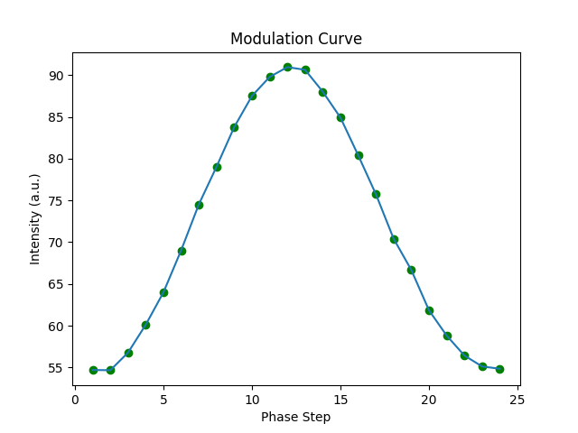</img>
 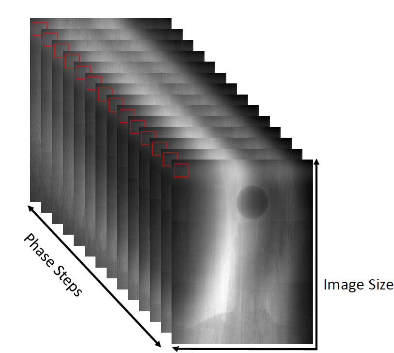</img>
</p>

## Experimental Retrieval

There are multiple algorithms to retrieve the Differential Phase Contrast (DPC) images, the goal is to fit the experimental data into a sine's shape curve and to do that you can use the FFT based algorithms or you can run a least squares method based algorithms. All of the algorithms are in [Experimental_Retrieval.py](Experimental_Retrieval.py) file.

### FFT based Algorithms
FFT-based algorithms are renowned for their exceptional speed. These algorithms are based on the Fast Fourier Transform (FFT), readily available in libraries such as NumPy, to efficiently identify the primary frequency and extract the sine wave corresponding to that frequency. When performing the FFT on a single pixel across various phase step points, you generate an image resembling the one depicted below.
<p align="center">
 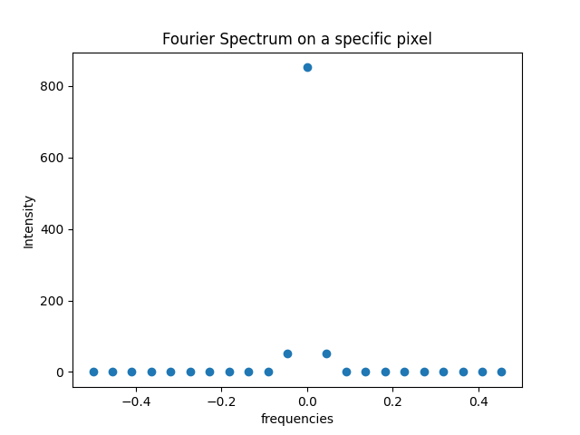</img>
</p>

The sine wave's offset corresponds to the real part of the amplitude value at the 0th frequency, while the phase and amplitude of the sine can be computed using the following equations:

$$ p = atan\left(\frac{b}{a}\right);\quad A = 2\sqrt{a^2+b^2} $$

Where  ${\color{red}a}$ and  ${\color{blue}b}$ are the  ${\color{red}real}$ and  ${\color{blue}imaginary}$ parts of the spectrum values for the first frequency. There are more ways to estimate the sine parameters with the FFT like using the numpy.angle function for the phase or estimating the offset like the mean value of the pixel intensity along the phase steps.

### Least Squares method based Algorithms
They use a least squares method to fit the data points into a sine shape curve. If you use curve_fit from scipy.optimize to fit the points to a sine or a cosine directly, the script will be very slow. However, it is posible to linearize the sine function making the numpy.linalg.lstsq function usable. 

$$ I_k\left(x,y\right) = {\color{red}a_0\left(x,y\right)}  + {\color{green}a_1\left(x,y\right)} \cdot \sin\left({\color{blue}s_k} + {\color{orange}p\left(x,y\right)} \right) =  {\color{red}a_0\left(x,y\right)}  +  {\color{green}a_1\left(x,y\right)} \cdot\left[\sin\left({\color{orange}p\left(x,y\right)} \right)\cdot\cos\left({\color{blue}s_k}\right) + \cos\left({\color{orange}p\left(x,y\right)} \right)\cdot\sin\left({\color{blue}s_k}\right)\right]$$


Here $I_k\left(x,y\right)$ is the Intensity of each pixel and on each k-phase step, $a_0$ is the offset of the Intensity Modulation Curve, $a_1$ is the amplitude, p is the phase and $s_k$ is the k-th phase step. The linear least squares problem can be rewritten as:

$$argmin \left||c-Ax\right||$$

with:

$$ A =  \begin{bmatrix}
1 & \cos(s_1) & \sin(s_1) \\
1 & \cos(s_2) & \sin(s_2) \\
. & . & . \\
. & . & . \\
. & . & . \\
1 & \cos(s_n) & \sin(s_n) 
\end{bmatrix}; \quad\quad 
x = \begin{bmatrix}
o  \\
a \\
b \\
\end{bmatrix};
\quad\quad
c = \begin{bmatrix}
I_1  \\
I_2 \\
.  \\
. \\
.  \\
I_n 
\end{bmatrix}$$

Then the parameters of the sine curve are obtained as follows:

$$
 {\color{red}a_0} = o;\quad\quad {\color{green}a_1} = \sqrt{a^2+b^2};\quad\quad {\color{orange}p} = atan\left(\frac{a}{b}\right)
$$

## DPC Images

Once the sine function is retrieve, we can retrieve the DPC Images. Using the Talbot-Lau interferometer and the phase stepping method it is posible to obtain the Differential Phase Contrast Image, which contains the information about the Phase Gradient introduced by the object. It is also posible to obtain the Transmission image and the last Image is the Dark Field Image which is related to the scattering produced by microstructures. Here we have defined this images like:


$$ DPC = p_{obj}-p_r;\quad\quad
T = \frac{a_{0,obj}}{a_{0,r}};\quad\quad
DF = \frac{a_{1,obj}\cdot a_{{0,r}}}{a_{1,r}\cdot a_{0,obj}}$$

## Phase Image
In principle, it is possible to obtain the Phase Image from the DPC Image through a straightforward integration over the x-direction. However, certain artifacts, such as horizontal fringes, emerge due to noise and image imperfections. To reduce these artifacts, we present the option of performing phase integration using a Wiener filter (refer to Reference [2]). By applying this filter, we effectively reduce noise interference in the image, as demonstrated in the following example. To achieve the best results in the Phase Image, we encourage you to experiment with various sets of parameters.

Reference [2]: Massimi, L., Buchanan, I., Astolfo, A., Endrizzi, M., & Olivo, A. (2020). Fast, non-iterative algorithm for quantitative integration of X-ray differential phase-contrast images. Optics express, 28(26), 39677–39687. https://doi.org/10.1364/OE.405755.

<p align="center">
 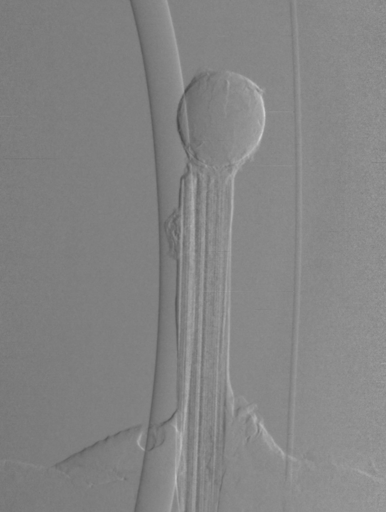</img>
 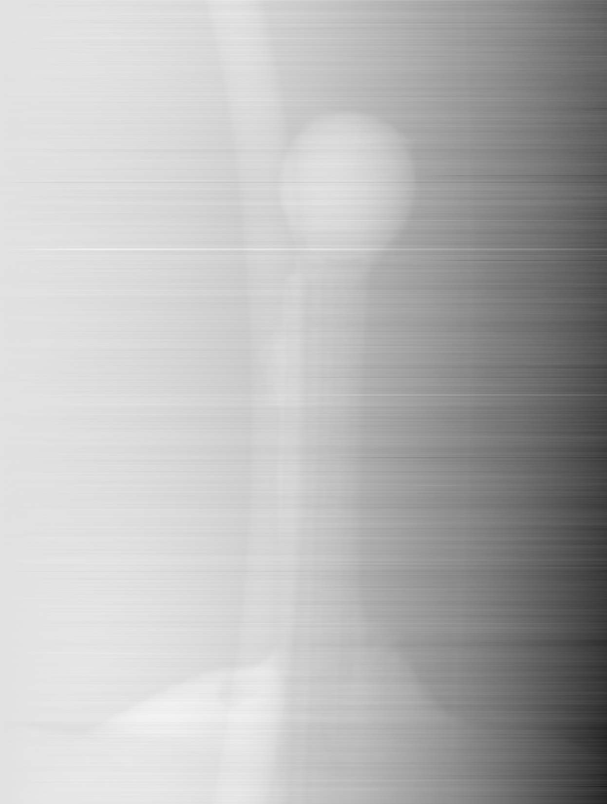</img>
 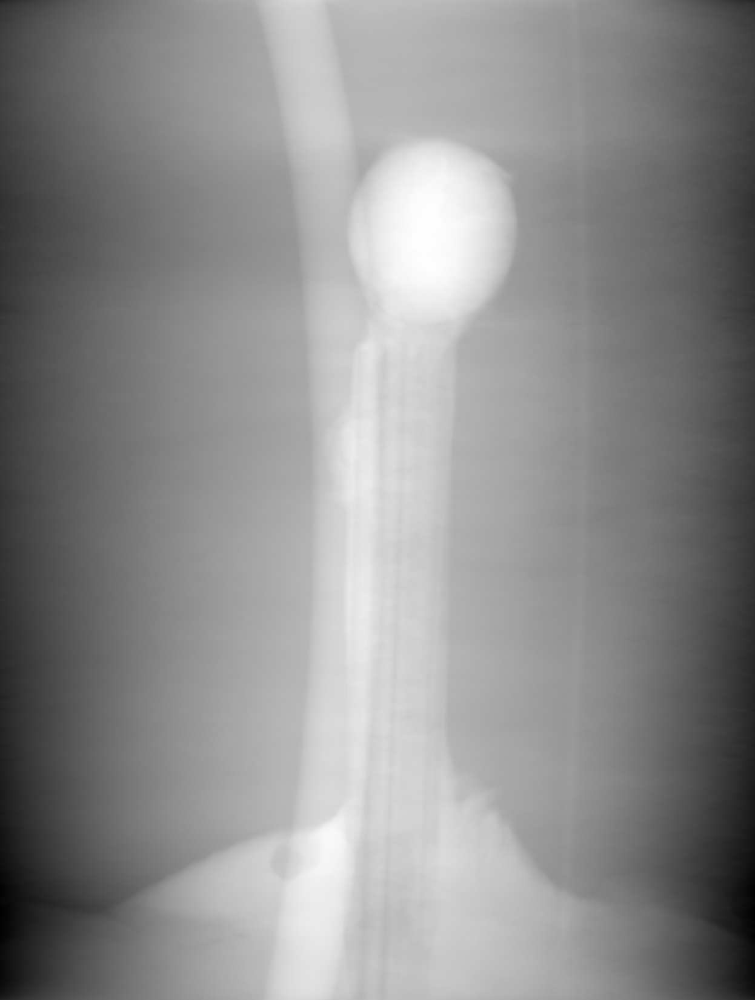</img>
</p>


## Example

```python
filename_images = 'object' #The name of the tiff file with the images. The name must no contain ".tif".
filename_reference = 'reference' #The name of the tiff file with the reference images. The name must no contain ".tif".

images = utils.read_Tiff_file(filename_images)
images_reference = utils.read_Tiff_file(filename_reference)
```
If the images are not into **Data Folder** you have to write the path to those images:

```python
reference_images_path = r'C:\Users\example\Reference_Images' #Without .tif
images_reference = utils.read_Tiff_file(reference_images_path)
```
The next thing is to write some parameters of the acquisition like the period of G2, the distance between G0 and G1 and the distance between G1 and G2, the distance between G1 and the object and the energy of design (the energy used to design the interferometer and to calculate the fractional Talbot-Lau distance). The units must be $\mu m$ for the period, cm for the distances and keV for the energy. For example:
```python
G2_Period = 6 # um
DSO = 25 #cm
DOD = 25 #cm
DG1_Object = 0 #cm
Design_energy = 35 #keV
```
The last thing is to write the reconstruction algorithm used and run the function to perform the retrieval of the DPC images.
```python
rec_type = 'Fast_FFT'
Diff_Phase, absorption, transmission, Dark_Field, Phase,  SC_Phase_reference, SC_Phase_object = Experimental_Retrieval.Modulation_Curve_Reconstruction(images, images_reference,                                                                                                           
    G2_Period,DSO, DOD, DG1_Object, Design_energy, type=rec_type)
```

The outputs are:
* Diff_Phase = Differential Phase Contrast Image
* absorption = Absorbtion Image defined as $ln\left(\frac{I_{0,obj}}{I_{0,ref}}\right)$
* transmission = Transmission Image defined as $\frac{I_{0,obj}}{I_{0,ref}}$
* Dark_Field = Dark Field Image defined as $\frac{V_{obj}}{V_{ref}}$
* Phase = Integrate Phase obtained by direct integration of Diff_Phase
* SC_Phase_Reference = Phase of the Stepping Curve for the Reference's Images
* SC_Phase_object = Phase of the Stepping Curve for the Object's Images

One example could be:

<p align="center">
 </img>
 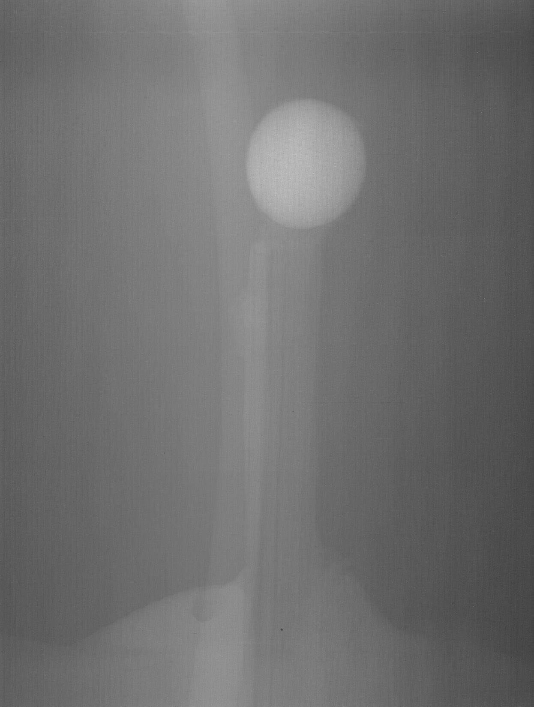</img>
 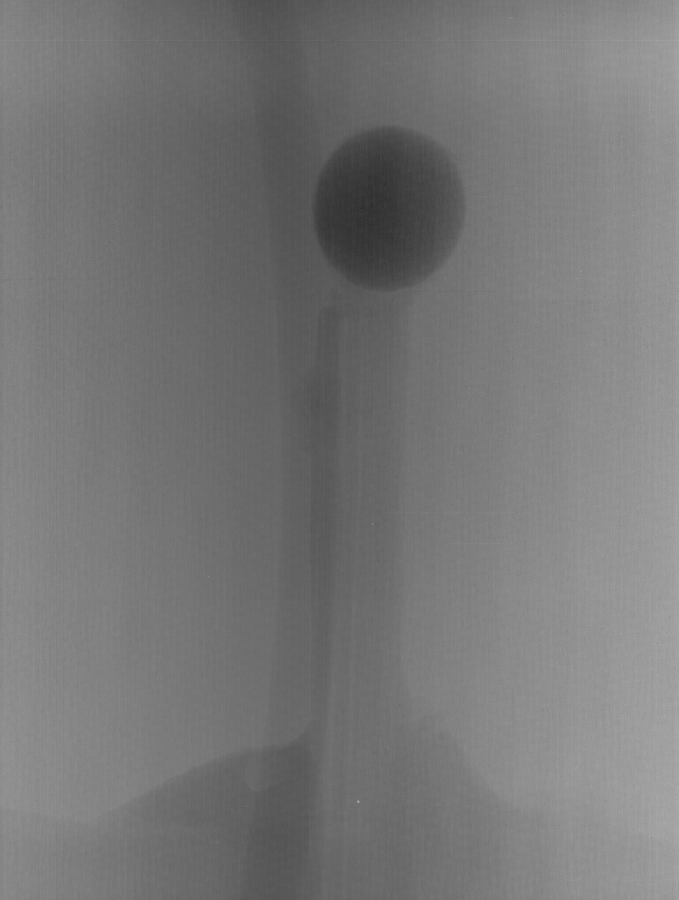</img>
 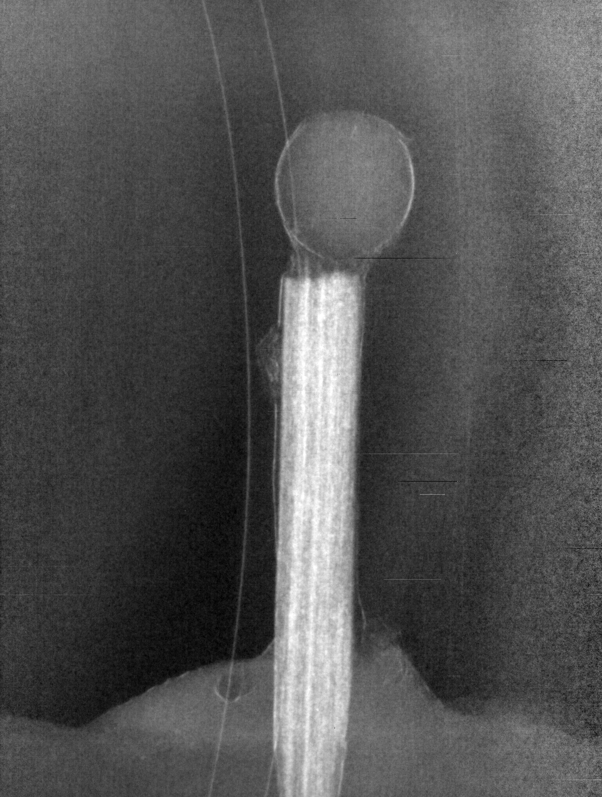</img>
</p>

<p align="center">
 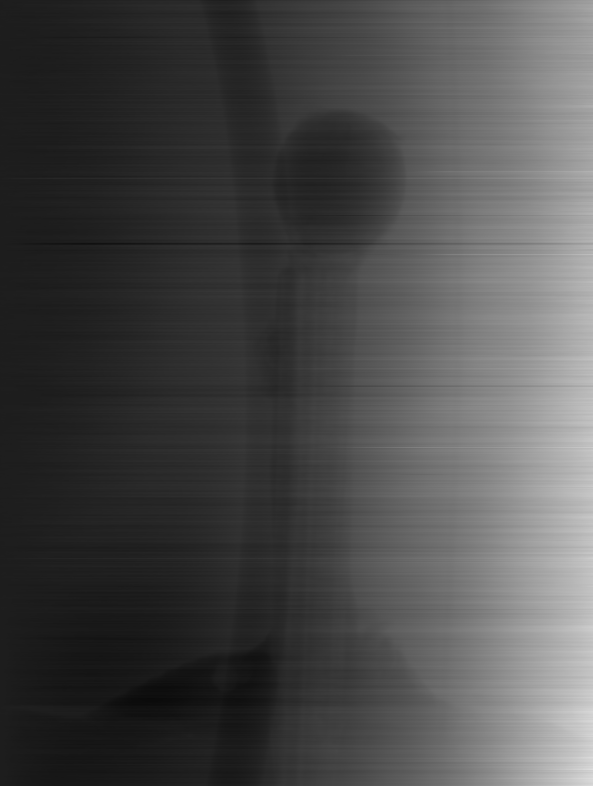</img>
 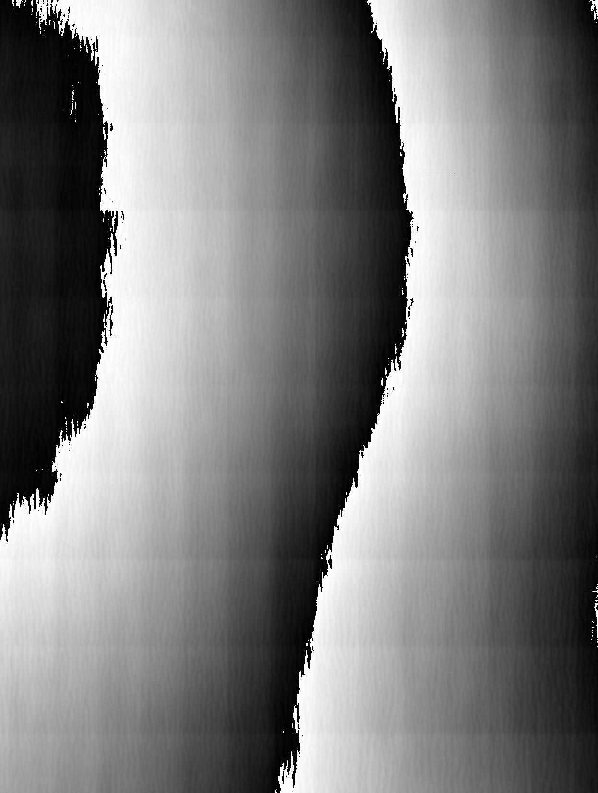</img>
 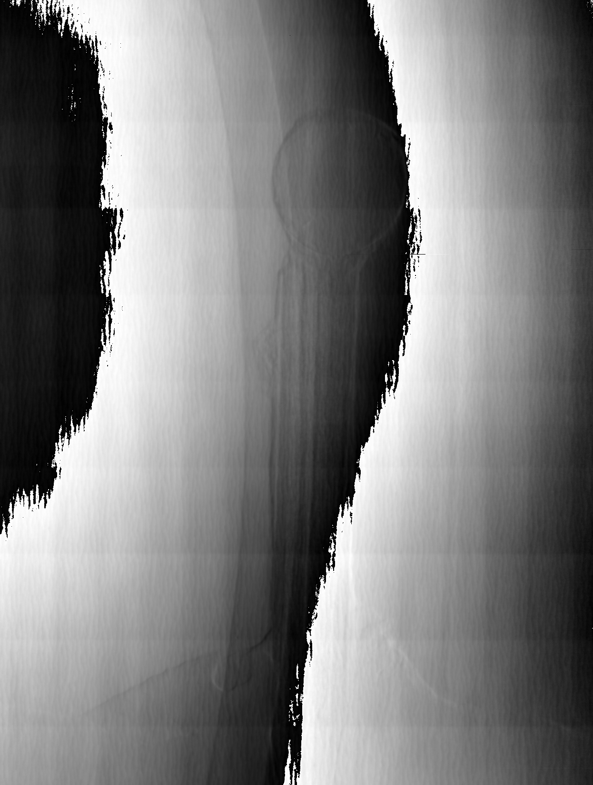</img>
</p>

If you want the integrated Phase obtained using the Wiener filter add the following lines to the code:

```python
Phase_wiener = utils.Calculate_Phase_Wiener_filter(Diff_Phase, x_pixel_size, y_pixel_size, v0, n, s)
```

With the parameters v0, n and s are the frequency cut-off in $mm^{-1}$, n is an integer (1 or 2) and s tries to estimate the SNR of the image, you can try which configuration works better with your images (see Reference [2]).


## Dependencies
We have use some functions from some well known python libraries, the libraries used are:
* numpy
* scipy
* matplotlib
* Pillow
* skimage from scikit
* numba (we use numba to accelerate some calculations)
* tifffile
* opencv
* imageio

In the future we will reduce the dependencies to make it easier to run. 
To install all the libraries type in your terminal.

```
pip install -r requirements.txt
```

## References

Reference [2]: Massimi, L., Buchanan, I., Astolfo, A., Endrizzi, M., & Olivo, A. (2020). Fast, non-iterative algorithm for quantitative integration of X-ray differential phase-contrast images. Optics express, 28(26), 39677–39687. https://doi.org/10.1364/OE.405755.


## Contact
If there is any doubt please contact at the following e-mail: vicsan05@ucm.es

